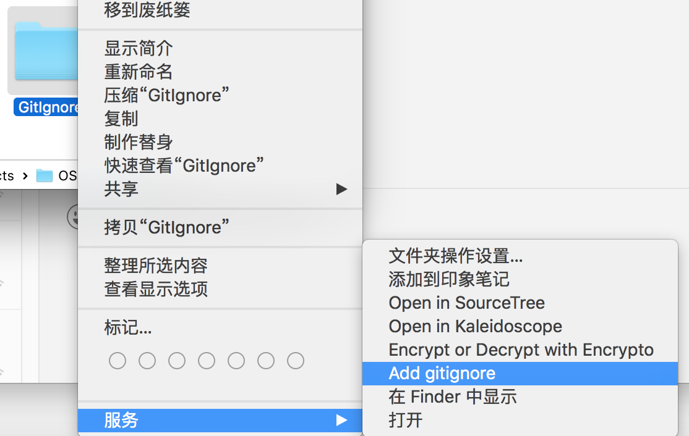
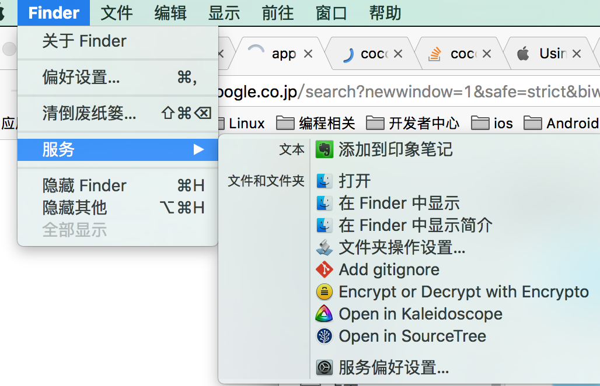
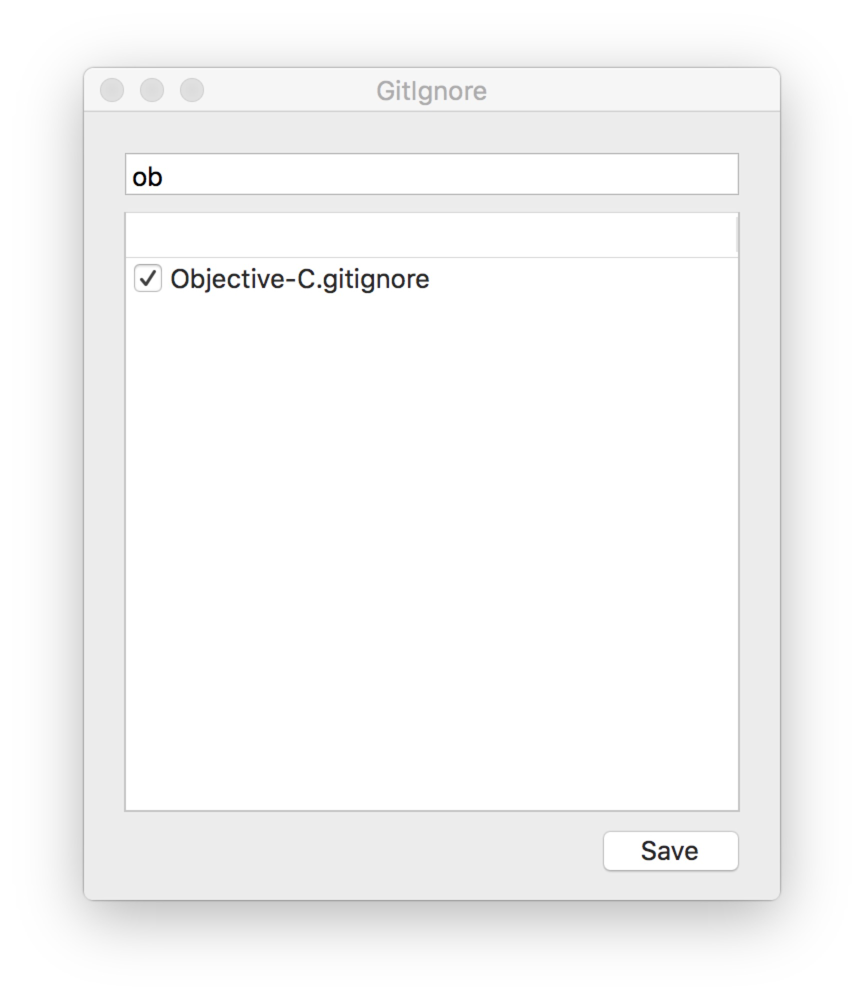

# GitIgnore

This app let you add .gitignore file to your git repo easy in OSX.

The .gitignore files are used from [Github gitignore](https://github.com/github/gitignore)

[Download app](https://github.com/skyhacker2/GitIgnore/releases)

First copy app to `/Applications` folder

And then right click your folder, service, Add gitignore.

Or select the folder, Finder, service, Add gitignore.

Filter and select which .gitignore you want to add.

